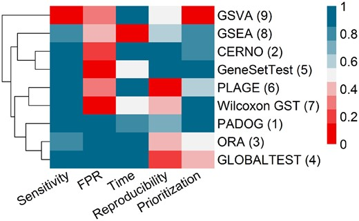

```{r,echo=FALSE}
## Set default options for the knitr RMD processing
knitr::opts_chunk$set(echo=FALSE,warning=FALSE,message=FALSE,fig.width=5,fig.height=5,cache=FALSE,autodep=TRUE, results="hide")
```

```{r libraries,cache=FALSE}
```

## First things first

.pull-left[

[https://github.com/january3/presentation-icsb-2022](https://github.com/january3/presentation-icsb-2022)

```{r}
library(qrcode)
plot(qr_code("https://github.com/january3/presentation-icsb-2022"))
```

[january.weiner@bih-charite.de](mailto:january.weiner@bih-charite.de)

]

.pull-right[
 
 * A few points to discuss
   - tmod
   - effect sizes: ROC curves and AUC
 * A short demo
   - using tmod/CERNO
   - combining with PCA
   - individual enrichments
   - leading edge analysis
   - custom gene sets
 * Your turn + discussion

]

---

## Gene set enrichments with tmod


.pull-left[


```{r}
plot(qr_code("https://github.com/january3/tmod"))
```


]


.pull-right[


[github.com/january3/tmod](https://github.com/january3/tmod)

]


---

## What is out there?





.myfootnote[

Zyla J, Marczyk M, Domaszewska T, Kaufmann SH, Polanska J, **Weiner 3rd J.** Gene set enrichment for reproducible science: comparison of CERNO and eight other algorithms. Bioinformatics. 2019 Dec 15;35(24):5146-54.
]


---


```{r results="markdown"}
library(tidyverse)
overview <- read_table("table_zyla.txt")
knitr::kable(overview)
```

.myfootnote[

Zyla J, Marczyk M, Domaszewska T, Kaufmann SH, Polanska J, **Weiner 3rd J.** Gene set enrichment for reproducible science: comparison of CERNO and eight other algorithms. Bioinformatics. 2019 Dec 15;35(24):5146-54.
]


---

.pull-left[

## Why am I using tmod?

 * CERNO is fast and reproducible
 * included gene sets are unique and useful
 * unique visualizations
 * tidyverse coding style rather than BioConductor coding style


]

--

.pull-right[

## When am I not using tmod?
 
 * I am required to use fgsea (using not the most popular package is often
   a pain in the neck!)

In these cases, I use both CERNO and fgsea and study the differences

 * small gene universe
   - olink
   - some metabolic profiling projects
   - nanostring

In this cases, I often use PLAGE (also implemented in tmod)


]

---

## Three things more important than the algorithm

--

 * a good model producing the ranked gene list
   * filtering noise
   * careful statistical analysis

--

 * carefully selected gene sets 

--

 * detailed inspection of results
   * look at the NEs / ROC curves ("evidence plots")
   


---

# Tips and tricks

---

## Working with an a priori hypothesis

  * *never* use the current data set to propose your hypothesis! 
  * use expert knowledge:
    * literature
    * experiments
  * which genes are expected to be transcriptionally regulated

---

## Effect size, AUC and ROC curves

 * good effect size measure does not depend
   on sample size (although can be correlated with p-value)
 * AUC (area under curve) has advantages:
   * easy to interpret and show graphically
   * related to rank biserial correlation (effect size for the U-test)


---

## Should we test for up- or down-regulated gene sets?

.pull-left[

### Yes 

 * nicely split gene sets into two groups
 * red and blue dots

However,

 * you can miss gene sets which contain anti-correlated genes


]


.pull-right[

### No

 * many gene sets contain genes that go both up and down
 * you can always diagnose the gene sets later, checking whether they
   mostly go up or down
 * terser visualisation
 * eigengenes can be used for visualisation as well
 


]


---

## Eigengenes

Basically: run a PCA on a gene set, take the first component (mind the
sign!), use this value as a relative per-sample pathway score
